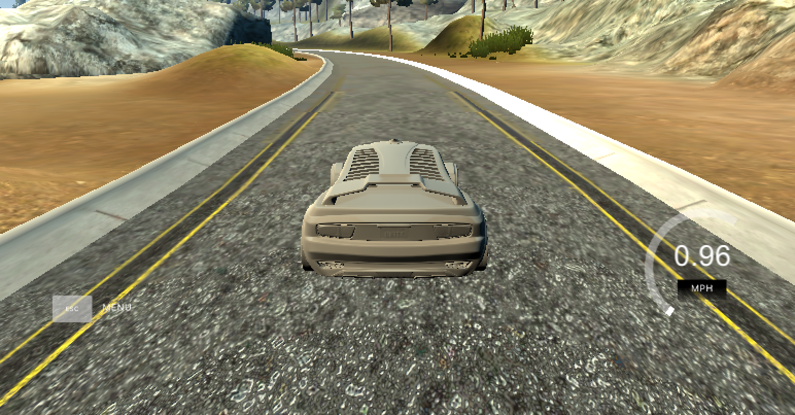
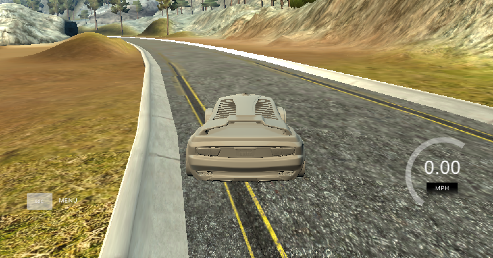
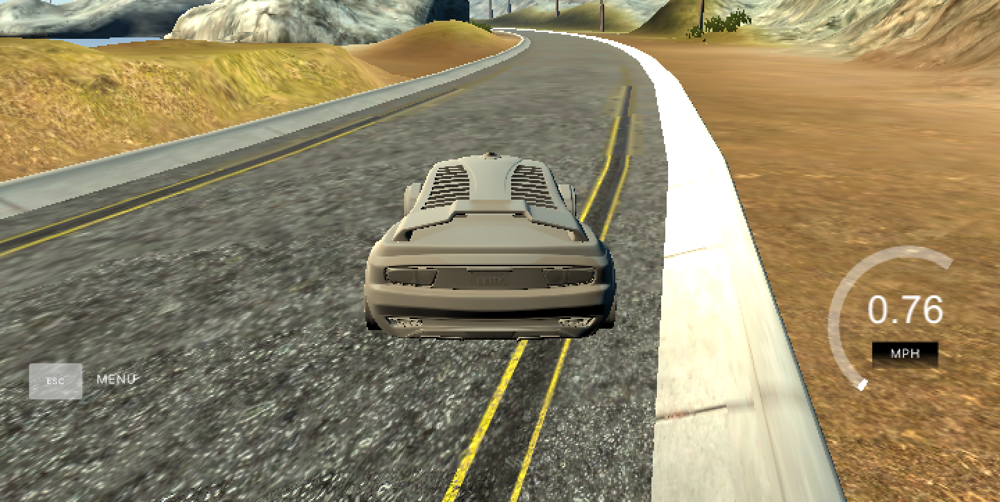

#**Behavioral Cloning** 

##Writeup Template

###You can use this file as a template for your writeup if you want to submit it as a markdown file, but feel free to use some other method and submit a pdf if you prefer.

---

**Behavrioal Cloning Project**

The goals / steps of this project are the following:

* Use the simulator to collect data of good driving behavior
* Build, a convolution neural network in Keras that predicts steering angles from images
* Train and validate the model with a training and validation set
* Test that the model successfully drives around track one without leaving the road
* Summarize the results with a written report


[//]: # (Image References)

[image1]: ./examples/placeholder.png "Model Visualization"
[image2]: ./examples/placeholder.png "Grayscaling"
[image3]: ./examples/placeholder_small.png "Recovery Image"
[image4]: ./examples/placeholder_small.png "Recovery Image"
[image5]: ./examples/placeholder_small.png "Recovery Image"
[image6]: ./examples/placeholder_small.png "Normal Image"
[image7]: ./examples/placeholder_small.png "Flipped Image"

## Rubric Points
###Here I will consider the [rubric points](https://review.udacity.com/#!/rubrics/432/view) individually and describe how I addressed each point in my implementation.  

---
###Files Submitted & Code Quality

####1. Submission includes all required files and can be used to run the simulator in autonomous mode

My project includes the following files:
* model.py containing the script to create and train the model
* drive.py for driving the car in autonomous mode
* model.h5 containing a trained convolution neural network 
* writeup.md or writeup.pdf summarizing the results

####2. Submssion includes functional code

Using the Udacity provided simulator and my drive.py file, the car can be driven autonomously around the track by executing 
```sh
python drive.py
```

####3. Submission code is usable and readable

The model.py file contains the code for training and saving the convolution neural network. The file shows the pipeline I used for training and validating the model, and it contains comments to explain how the code works.

###Model Architecture and Training Strategy

####1. An appropriate model architecture has been employed

I've tried different approaches for model architecture, but the final one is in neural_net.py, and described in details below.

####2. Attempts to reduce overfitting in the model

The single dropout layer included seems to be at the optimal point to avoid overfitting and not underfit the model - adding another dropout layer, or removing the single dropout added, have a negative impact on the results.

The model was tested by running it through the simulator and ensuring that the vehicle could stay on the track.

A simple regularization strategy used was to train the model less - the loss function was not an accurate predictor of how the car would drive, so from my experimentation I've come to the conclusion that training less was a good way of avoiding overfitting.

####3. Model parameter tuning

The model used an adam optimizer, so the learning rate was not tuned manually.

####4. Appropriate training data

For the training data, I've driven the car using a joystick. I have not used Udacity data, as this project was completed before Udacity data was available.

I have driven it as racing car, using the entire width of the lane, making closed and open curves alternatively to record as more options as possible.

###Model Architecture and Training Strategy

####1. Solution Design Approach

I've tried the model described in nvidia paper, with 200x66 images, and a lot of layers. In all tests I run I've got very similar results, though, with a much smaller network and 32x16 images and 3 channels. I was first using a single channel (Y), but results improved a lot when I switched back to RGB.

Performance was a must for this project. I don't have local GPU, my local machine is simple, and using AWS was not practical since the upload speed of my network is not good enough to upload new images to AWS (even after I resized them). I usually have the option of using the high performance lab at the university, but I'm travelling currently.

So I've tried several simpler neural networks until I arrived at the network described above, that uses images resized to 16x32, 1% of their original size

I've also thought at first about training a model for each camera, and use an ensemble like results (like an average of the 3 predictions). However, I found out later driver.py only gets access to the center camera.

To test, I've ran the model in the simulator to see how well the car was driving around track one. There were a few spots where the vehicle fell off the track, so to improve driving, I've recorded the recoveries from left to right and right to left whenever the car went off lane. 

At the end of the process, the vehicle is able to drive autonomously around the track without leaving the road.

####2. Final Model Architecture

My final model has the following layers:
Features Creation:

- A BatchNormalization layer
- Convolutional 5x5 (stride 1x1)
- Max Pooling 2x2 
- Convolutional 4x4 (stride 1x1)
- Max Pooling 2x2

Classifier:

- Fully connected layer, 300
- Dropout 50%
- Fully connected layer, 50
- Fully connected layer, 1

For all layers tanh was used as the non linear activation function.

####3. Creation of the Training Set & Training Process

For the final model, I've recorded 3 types of driving: regular, and left-to-right and right-to-left corrections. In the correction trainings I would only consider the rows in which the angle indicates it is a correction (in right-to-left, the negative angles for example). That helped in making the training process faster, so I could avoid hitting pause and record button a lot of times.

Here is an example image of center lane driving:



I then recorded the vehicle recovering from the left side and right sides of the road back to center so that the vehicle would learn to correct its course if it started to go off road These images show what a recovery looks like starting from:




After the collection process, I've done the data analysis on some sets and found out there were angle peaks, which were caused by bad driving, like the joystick slipping. I then smoothed the data using numpy.convolve, with an average of 30 frames windows. To smooth the data I first had to separate each training group (to ensure I would not blend frames of different groups). I captured the datetime from the filename and considered larger than 5 seconds transitions as a transition to a different group. Although smoothing helped, it is not used in the final solution.

I've tinkered with removing outliers, above or below a datapoint, which did not perform well since the curves requires a wide angle (specially on track 2). I've also tinkered with using moving averages on drive.py to smooth the driving, which also did not perform well

I used an adam optimizer so that manually training the learning rate wasn't necessary.

####4. Other considerations

What I found most interesting about this project is gathering data. That was very challenging for me - I got bad results with keyboard, and once I changed to joystick, I then had the issue I can't handle a joystick (last videogame I had was a 16bits Mega Drive, no joystick back then). So my training data is not good, and following the saying "trash in trash out", my model would therefore follow it.

I got stuck at a suboptimal results, which I will try to push later when I get access to more hardware. It completes the first track most of the times. The first model I've created performed very good on the second track, but I started from scratch to try to improve the results further and decided to focus on the first track only to save some time.

Some other improvements to implement are generating more images based on the original images, re-balance the dataset to have a more or less equal data points for each direction, and set up an improved process of validating the model which would not require running the simulator to assess its performance.  