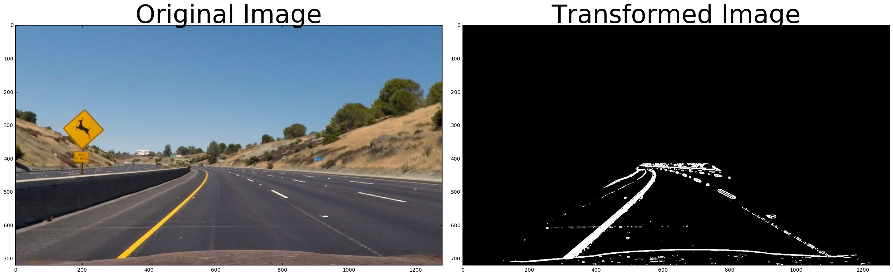

# Advanced Lane Finding Project

The goals / steps of this project are the following:

* Compute the camera calibration matrix and distortion coefficients given a set of chessboard images.
* Apply a distortion correction to raw images.
* Use color transforms, gradients, etc., to create a thresholded binary image.
* Apply a perspective transform to rectify binary image ("birds-eye view").
* Detect lane pixels and fit to find the lane boundary.
* Determine the curvature of the lane and vehicle position with respect to center.
* Warp the detected lane boundaries back onto the original image.
* Output visual display of the lane boundaries and numerical estimation of lane curvature and vehicle position.

[//]: # (Image References)

[image1]: ./examples/undistort_output.png "Undistorted"
[image2]: ./test_images/test1.jpg "Road Transformed"
[image3]: ./examples/binary_combo_example.jpg "Binary Example"
[image4]: ./examples/warped_straight_lines.jpg "Warp Example"
[image5]: ./examples/color_fit_lines.jpg "Fit Visual"
[image6]: ./examples/example_output.jpg "Output"
[video1]: ./project_video.mp4 "Video"

## [Rubric](https://review.udacity.com/#!/rubrics/571/view) Points
###Here I will consider the rubric points individually and describe how I addressed each point in my implementation.  

---
### Writeup / README

#### 1. Provide a Writeup / README that includes all the rubric points and how you addressed each one.  You can submit your writeup as markdown or pdf.  [Here](https://github.com/udacity/CarND-Advanced-Lane-Lines/blob/master/writeup_template.md) is a template writeup for this project you can use as a guide and a starting point.  

This writeup is just a short summary, as required in the project instructions. Please make sure to go through P4-image and P4-video for the full code, images and implementation. Both notebooks are well organized in term of project goals and are a more complete substitute for this write up, and you can read it in the same sequence of this writeup, so I will not mention code lines. 

Support functions can be found in support_func.py. Most of the support functions were first implemented in P4-image notebook, in a step by step approach, and then converted into functions to be used for the video pipeline.

### Camera Calibration

#### 1. Briefly state how you computed the camera matrix and distortion coefficients. Provide an example of a distortion corrected calibration image.

I started by preparing "object points", which will be the (x, y, z) coordinates of the chessboard corners in the world. Here I am assuming the chessboard is fixed on the (x, y) plane at z=0, such that the object points are the same for each calibration image.  Thus, `objp` is just a replicated array of coordinates, and `objpoints` will be appended with a copy of it every time I successfully detect all chessboard corners in a test image.  `imgpoints` will be appended with the (x, y) pixel position of each of the corners in the image plane with each successful chessboard detection.  

I then used the output `objpoints` and `imgpoints` to compute the camera calibration and distortion coefficients using the `cv2.calibrateCamera()` function.  I applied this distortion correction to the test image using the `cv2.undistort()` function and obtained this result: 


### Pipeline (single images)

####1. Provide an example of a distortion-corrected image.
To demonstrate this step, I will describe how I apply the distortion correction to one of the test images like this one:


#### 2. Describe how (and identify where in your code) you used color transforms, gradients or other methods to create a thresholded binary image.  Provide an example of a binary image result.

For the images, I used a combination of region selection, color and gradient thresholds to generate a binary image.  Here's an example of my output for this step:



My final image preprocessing (applied to the warped image) is implemented in the function preprocess, in P4-video notebook, and replicated below. The parameters were defined based on extensive experimentation:

```
color_binary = color_thresh(img, thresh=(150,255))
gray = cv2.cvtColor(img, cv2.COLOR_RGB2GRAY)

#gradient
gradx_binary = abs_sobel_thresh(gray, orient='x', sobel_kernel=5, thresh=(40,100))
grady_binary = abs_sobel_thresh(gray, orient='y', sobel_kernel=7, thresh=(40,100))
mag_binary = mag_thresh(gray, sobel_kernel=15, thresh=(20,100))
dir_binary = dir_thresh(gray, sobel_kernel=15, thresh=(0.70,1.3))

combined = np.zeros_like(gray)
combined[((gradx_binary == 1) & (grady_binary == 1)) | ((mag_binary == 1) & (dir_binary==1)) | (color_binary==1)] = 1
```

For the video, though, I've experimented with a different approach which had better outputs. In this alternative approach I've first warped the image, using perspective transform, and then applied gradient and color thresholding to enhance the image and make it easier to identify lane lines. Here is an example of the output for this alternative approach:


#### 3. Describe how (and identify where in your code) you performed a perspective transform and provide an example of a transformed image.

For the perspective transform, I identified 4 points in a straight lane image that could be used as a source to calculate the M matrix for perspective transform. For the destination, I've defined min and max height and a 300 pixels offset for the width each side, making a rectangle.

I chose the hardcode the source and destination points in the following manner:

```
# set source
src = np.array([[610, 440],[667, 440],[1050,675],[260,675]], dtype=np.float32)

# set destination
offset = 300
h,w = undist_img.shape[:2]
dst = np.array([[offset,0],[w-offset,0],
                [w-offset, h],[offset, h]], 
               dtype=np.float32)

```

I verified that my perspective transform was working as expected by drawing the `src` and `dst` points onto a test image and its warped counterpart to verify that the lines appear parallel in the warped image.

Full implementation in P4 notebook.


#### 4. Describe how (and identify where in your code) you identified lane-line pixels and fit their positions with a polynomial?

To identify lane-line pixels, I've used Udacity's approach of slicing the image vertically into several slices (18), using histogram peaks to define the most probable location of the lane in the first slice, and sliding vertical windows based on the center and fixed width to determine where to look for the centers in the next slices.

After detecting the center for every slice, I've fitted a second order polynomial. I've applyed generated y values for each of the equations to estimate the x-values for each lane. These (x,y) pairs were used to fit the lane.


#### 5. Describe how (and identify where in your code) you calculated the radius of curvature of the lane and the position of the vehicle with respect to center.

The radius of the curvature and the position of the vehicle is defined in the function measure_curvature, in support_func.py, using the formula described in the course. 


The position of the vehicle with respect to center is calculated directly in the image pipeline, defined in P4-video, which is simply the distance between the image center and the lane center


#### 6. Provide an example image of your result plotted back down onto the road such that the lane area is identified clearly.

Here is one example. Several more are plotted in P4-video.


---

### Pipeline (video)

#### 1. Provide a link to your final video output.  Your pipeline should perform reasonably well on the entire project video (wobbly lines are ok but no catastrophic failures that would cause the car to drive off the road!).

Here's a [link to my video result](output.mp4)

---

### Discussion

#### 1. Briefly discuss any problems / issues you faced in your implementation of this project.  Where will your pipeline likely fail?  What could you do to make it more robust?

I've done many interations on this project, so a lot of my implementation is based on experimentation. I've mostly experimented of how to keep track of the lanes in video - what attributes should I keep for each line, when should I consider data from previous frames and when should I use new data.

Doing color and gradient thresholding after warping the image, instead of before, helped me improve my pipeline. I've also experiment with different source points for the perspective transform process, and small variations had a huge impact on the final result. I could try to get multiple src and dst points and combine them somehow (like an average) to have a a better suited M matrix.

My pipeline fails in the challenge video, since it is not able to properly detect the lanes. Improved image preprocessing based on color would certainly improve it - knowing the left lane is yellow and continuous and the middle one is white and dotted is something I did not take advantage of.

In the harder challenge, the curves are too closed, and the video doesn't always record both lanes. Using the information of one lane to infer the position of the other lane is something which I could apply to the pipeline to make it more robust for the hearder challenge.
