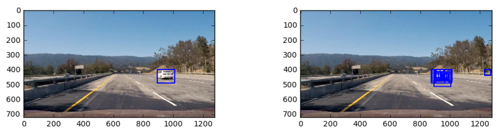

##Writeup Template
###You can use this file as a template for your writeup if you want to submit it as a markdown file, but feel free to use some other method and submit a pdf if you prefer.

---

**Vehicle Detection Project**

The goals / steps of this project are the following:

* Perform a Histogram of Oriented Gradients (HOG) feature extraction on a labeled training set of images and train a classifier Linear SVM classifier
* Optionally, you can also apply a color transform and append binned color features, as well as histograms of color, to your HOG feature vector. 
* Note: for those first two steps don't forget to normalize your features and randomize a selection for training and testing.
* Implement a sliding-window technique and use your trained classifier to search for vehicles in images.
* Run your pipeline on a video stream and create a heat map of recurring detections frame by frame to reject outliers and follow detected vehicles.
* Estimate a bounding box for vehicles detected.

[//]: # (Image References)
[image1]: ./examples/car_not_car.png
[image2]: ./examples/HOG_example.jpg
[image3]: ./examples/sliding_windows.jpg
[image4]: ./examples/sliding_window.jpg
[image5]: ./examples/img50.jpg
[image6]: ./examples/example_output.jpg
[video1]: ./project_video.mp4

## [Rubric](https://review.udacity.com/#!/rubrics/513/view) Points
###Here I will consider the rubric points individually and describe how I addressed each point in my implementation.  

---
###Writeup / README

####1. Provide a Writeup / README that includes all the rubric points and how you addressed each one.  You can submit your writeup as markdown or pdf.  [Here](https://github.com/udacity/CarND-Vehicle-Detection/blob/master/writeup_template.md) is a template writeup for this project you can use as a guide and a starting point.  

You're reading it! Along with this writeup, which is just a summary based on the template writeup, there is a notebook containing all code in the sequence of the goals described above. If you follow the notebook along the writeup the code will match the same sequence, so I will not mention code lines.

###Histogram of Oriented Gradients (HOG)

####1. Explain how (and identify where in your code) you extracted HOG features from the training images.

I started by reading in all the `vehicle` and `non-vehicle` images.  Here is an example of one of each of the `vehicle` and `non-vehicle` classes:


I then explored different color spaces and different `skimage.hog()` parameters (`orientations`, `pixels_per_cell`, and `cells_per_block`).  I grabbed sample images from each of the two classes and displayed them to get a feel for what the `skimage.hog()` output looks like.

Here is an example using the gray image and HOG parameters of `orientations=9`, `pixels_per_cell=(8, 8)` and `cells_per_block=(2, 2)`:


####1b. Other features

I've also two other groups of features, spatial binning of color in RGB color space, and histograms per channel, also using RGB color space.

Here is a demonstration of the spatial binning of color:


And color histograms for a car image


And non-car image:


####2. Explain how you settled on your final choice of parameters.

I tried various combinations, and evaluated their performance by measuring the classifier's accuracy in predicting a car.


To extract HOG features, the final parameters are:

* color_space = 'YCrCb'
* orient = 9
* pix per cell = (16, 16)
* cell per block = (4, 4)
* hog_channel = 'ALL'

For the spatial bin features, the parameters are: 

* color_space = 'RGB'
* spatial_size = (32, 32) 

For the color histogram features, the parameters are:

* color_space = 'RGB'
* hist_bins = 32 # 16

####3. Describe how (and identify where in your code) you trained a classifier using your selected HOG features (and color features if you used them).

I trained a linear SVM using HOG, spatial bin and color histogram features. My final choice of features yields a classification accuracy of 99.16%, validated on 20% of the data randomly selected.

###Sliding Window Search

####1. Describe how (and identify where in your code) you implemented a sliding window search.  How did you decide what scales to search and how much to overlap windows?

For the sliding window search, I've done two modifications to the plain algorithm:

* Restrict the area of search. For optimization I'm not searching anywhere above 400px in the y-axis or below 500px line in the x-axis, since no cars would show in these regions.
* I've created a small dictionary with horizontal slices of the image, and the more or less the expected size of the car to appear in that region. This dictionary will tell what size of window to search for each region

```
region_window = [[(680,400), (260,260)],
                [(600,400), (220, 220)],
                [(560,400), (166, 166)],
                [(540,400), (132,132)],
                [(520,400), (114,114)],
                [(500,400), (90,90)],
                [(480,400), (78,78)],
                [(470,400), (56,56)],
                [(460,400), (40,40)]]
```

Here is the result:


The final model has an overlap of windows of 75%.

####2. Show some examples of test images to demonstrate how your pipeline is working.  What did you do to try to minimize false positives and reliably detect cars?

Ultimately I searched on two scales using YCrCb 3-channel HOG features plus spatially binned color and histograms of color in the feature vector, which provided a nice result.  Here are some example images:




Detecting false positives was the challenging part of the project. At the end the algorithm was able to rule all false positives in the test video.

I've followed a few approaches, I will divide them between approaches applied to  image and test video. In this section I will discuss the image filters.

##### Heatmap 

I'm using a heatmap to detect which areas are most likely to have the image searched for. Each window which tests positive in the classifier adds 1 to the heatmap for each pixel in the window. After adding all the identified windows, I apply a threshold to determine which pixels will be used to determine the final bounding box. Since my sliding windows have a 75% overlap, I'm using a threshold of 10 pixels.

I later identify the labels in the heatmap using scypy labels function (`scipy.ndimage.measurements.label`). Each blob in the image will correspond to a label. 

##### Window size sanity checks

After a label is identified in the heatmap, I make a sanity check in the size to see if it corresponds to the expected size of the vehicle. I compare the width and height to the expected width and height in my window size per region dictionary. If the height is higher than 50% of the expected height, and the width is higher than 50% of the expected width, it passes the sanity check. This avoids small regions which could not correspond to a car. 

The more than 50% cut-off can be increased later by making a make a more precise window size per region dictionary, I only did an estimation by analyzing a few test images.

---

### Video Implementation

####1. Provide a link to your final video output.  Your pipeline should perform reasonably well on the entire project video (somewhat wobbly or unstable bounding boxes are ok as long as you are identifying the vehicles most of the time with minimal false positives.)
Here's a [link to my video result](./output.mp4)

####2. Describe how (and identify where in your code) you implemented some kind of filter for false positives and some method for combining overlapping bounding boxes.

The method used to combine overlapping bounding boxes in images is the heatmap, described in the Image Implementaiton section.

The approaches used to detect false positives in video are:

##### Identifying each car in the heatmap.

For each label, I first check if it belongs to an existing car: if it does, I update the attributes of an existing car; if it does not, I create a new car instance.

The cars are tracked using a Car class. The car instance is initiated whenever I find a new label which does not correspond to any existing car. To check if the label to an existing car, I make two checks:

 * Calculate the euclidean distance between the label centroid and the car centroid. If the distance is less than 30px, I assume the label corresponds to the same car
 * Check if the coordinates are within the bounding box of an existing car. If the existing label is contained in the box of an existing car, then I assume it corresponds to that car

When a label corresponds to the car, I update the height, width and centroid attributes of the car instance. With these 3 attributes I'm able to draw a bounding box around the car.

To draw a bounding a box (and to check if the label corresponds to a car) I use a weighted average of the last 10 centroids, widths and heights calculated for that car (10 or less, depending on how much data I have collected for each car). Using this approach I have a more stable position and less flickery bounding boxes on video. Keeping track of all identified values also allows me to extrapolate the existing values to estimate the car position in the next frame.

##### Waiting confirmation before drawing a bounding box

I keep track of how many frames have passed since he was first identified and in how many frames the car was able to be located. I only show a bounding box if the car was identified in at least 5 frames, which is a key component in removing false positives

On the other hand, after the car is confirmed, I keep showing the box (using the weighted average centroid, height and width), which ensures that the bounding box is stable even if the algorithm misses it in a frame. When the difference between number of frames and number of identifications is larger than 3, the car instance is 'retired', and it will not be used anymore except for log data.


All these parameters discussed in the image and video false positive discussion sections can be customized and optimized.

---

###Discussion

####1. Briefly discuss any problems / issues you faced in your implementation of this project.  Where will your pipeline likely fail?  What could you do to make it more robust?

The approach is mainly detailed above, so I will focus on issues faced and what can be improved:

* By aggressively removing false positives, the heatmaps identified a smaller region for each car. So instead of using the heatmap height and width for the bounding box, I can use it only to calculate the centroid, and use an estimation of the car's height and width for that particular region of the image to calculate the bounding box instead of the heatmap. In order to do that I need a more precise estimation of the car expected size based on x and y coordinates (my implementation is based on y values only, but car sizes varies per x position as well, since cars to the right will look bigger than cars in the center)
* Using an expected size for the height and width would also ensure a more stable bounding box between frames.
* Tracking the centroids, I could derive a function to estimate what is the estimated position of the car in the next frame, and compare that position to the identified centroid in the new frame. As the car is identified in more frames, the more precise the function is, and I eventually it accuratelly predict the car position without having to parse the new frame.
* I have not used undistorted images, but it is one approach I would like to try later

The main issue I faced was not being able to implement HOG features once and use in all windows, using my specific sliding windows approach. So the algorithm was not performative and it took a long time to train a video. I need to investigate into this further and solve this issue, in order to be able to iterate fast between experimentations. 
